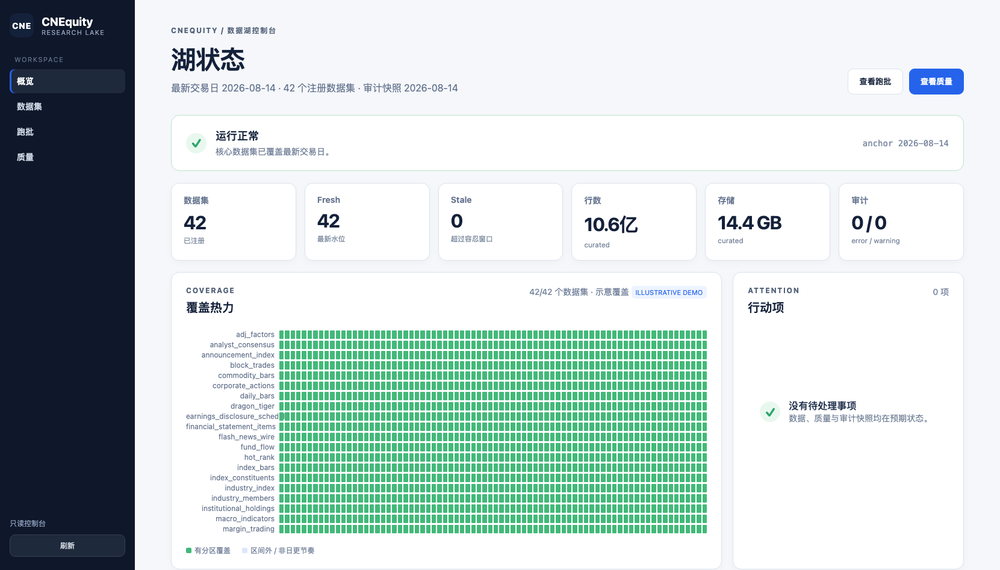

<h1 align="center">CNEquity · Open financial data infrastructure</h1>
<p align="center"><b>Starting with China's A-share market, CNEquity turns fragmented sources into a refreshable, reproducible local data layer for people and AI agents.</b></p>

<p align="center">
  <a href="https://github.com/rootSunc/CNEquity/actions/workflows/ci.yml"></a>
  <a href="https://pypi.org/project/cnequity/"></a>
  <a href="https://www.python.org/downloads/"></a>
  <a href="LICENSE"></a>
  <a href="https://rootsunc.github.io/CNEquity/"></a>
  <a href="README.md"></a>
</p>

<p align="center">
  Open, self-hosted, and signup-free. Ingest once, refresh daily, and serve the same contract to Python, DuckDB, Polars, or AI agents.<br>
  <b>42 registered datasets · adjustment / historical universes / PIT · 6 MCP tools · row-level provenance</b>
</p>

<p align="center">
  
</p>

<p align="center"><sub><code>cne serve</code>, read-only console — a real capture: tier, fetch semantics, partition granularity, watermark, row count and size per dataset</sub></p>

CNEquity is open financial data infrastructure for China markets. It starts with A-shares and turns fragmented market, fundamental, event, flow, industry, and macro sources into an open, local data layer with provenance and a stable research contract.

## Why a lake

<p align="center">
  
</p>

The same equal-weight buy-and-hold, the same dates. The only difference is
**whether names that later delisted are still in the basket**. Use "stocks that
exist today" as a historical universe — all a current-roster vendor can give
you — and the 2016–2021 five-year return goes from **5.9% to 12.0%**, twice
what it was.

The error **is not visible**: those names are not zero, they are absent.
Delisted names, adjustment factors, and PIT are first-class here — not an
afterthought on a coverage list.

```bash
python scripts/survivorship_gap.py --svg docs/assets/survivorship-gap.svg
```

## Why not just AkShare / Tushare / a fetch skill

AkShare and agent fetch skills answer "how do I fetch?" — a snapshot of now,
with no history contract. Tushare is cloud wide tables. Qlib / vn.py are
research / trading platforms. **CNE** owns the middle: many sources, one
contract, a resumable local Parquet lake.

| What you care about | **CNEquity** | AkShare / efinance | Tushare Pro | Baostock | Qlib / vn.py |
|--|--|--|--|--|--|
| Local, resumable data base | **Lake + daily jobs** | On-demand; you orchestrate | Cloud credits | Session fetch, no lake | Platform-tied |
| Provenance | **Row-level + validated on write** | No shared contract | Platform fields | No lake contract | Varies |
| Research semantics | **`load()`: adjust / universe / PIT** | DIY | DIY | DIY | Platform |
| Delisted names kept | **Yes — no survivorship bias** | Up to caller | Per endpoint | Per endpoint | Per source |
| When a source fails | **Fail the batch**, retry by batch | Up to caller | Up to vendor | Up to vendor | Varies |
| Signup / token needed | **No** | No | Credits required | No | Per source |

Point by point: [comparison](docs/comparison.md).


## Data in ~30 seconds

```bash
pip install cnequity    # no token, credit, or signup
cne demo                   # real data: 5 names × 30 sessions
cne demo --sample            # deterministic synthetic lake; no network
```

Measured at about 25 seconds. Needs **TDX quote hosts** reachable (mainland access is more reliable);
if it fails, run `cne doctor` (no config or network needed), then
`cne sources probe --only tdx_protocol --config configs/cnequity.demo.toml`.
With no network at all, `cne demo --sample` builds an offline lake instead. The demo writes to its own
`data/cnequity-demo/` directory and never touches a full lake.

If TDX is unreachable, `cne demo --sample` still verifies installation, Parquet writes,
DuckDB views, and the public query path. Every generated row is visibly marked
`source=mock`; it is for onboarding only, never research.

<p align="center">
  
</p>

```python
from cnequity.query import load

bars = load("daily_bars", data_root="data/cnequity-demo")
```

If you only need a current quote, a fetch API may be enough. Build a lake when you need reproducible history,
survivorship-safe universes, or point-in-time research.

To see why the adjustment contract matters (this also queries Sina and expands to about three years):

```bash
cne demo --research --symbols 600519.SH
# raw return -24.25% → hfq return -14.39% (example output; changes with the as-of date)
```

## What it gives you

| | |
|---|---|
| **Ingestion** | 42 datasets · 14 upstream sources · primary/backup routing · per-batch retry, resume and watermark reconciliation |
| **Research semantics** | Adjustment (hfq / qfq derived at query time) · historical index and industry membership · point-in-time fundamentals · **delisted names kept** |
| **Data contract** | Schema validated before write · row-level provenance (`source` / `data_version` / `fetched_at`) · breaking changes require a version bump |
| **Quality** | 84 audit checks · cross-source comparison · coverage-gap and staleness detection · configurable publication gate |
| **Storage** | Local Parquet + DuckDB · per-dataset partition granularity · atomic writes · immutable generations and time travel |
| **Consumption** | `load()` · DuckDB views · Polars · 6 MCP tools · read-only operations console |
| **Operations** | Daily orchestration · launchd / cron templates · source health probes · portable snapshots and delta packages |

Everything runs locally. **No signup, token or credits.**

## Glance at the lake

Once the lake is up, `cne serve` is the read-only operations console. The
overview shows health, Fresh / Stale counts, the coverage heatmap and action
items; datasets, runs and quality are separate pages. It never writes the
lake — ingestion, retry and cleanup stay on the CLI.

```bash
cne serve     # http://127.0.0.1:8787
cne sources probe   # health of 14 upstream hosts (probe on CLI, display on serve)
```

<p align="center">
  
</p>

<p align="center"><sub>Overview page. Synthetic README illustration, marked <code>ILLUSTRATIVE DEMO</code> in the image — the full-coverage heatmap is not a claim about current production data.</sub></p>

Details: [serve](docs/modules/serve.md) ·
[source-health](docs/operations/source-health.md).

## What you can ask it

| What you want to know | How you get it |
|--|--|
| Moutai five-year return, adjusted | `load("daily_bars", symbols=[...], adjust="hfq")` |
| ★ Moutai PE historical percentile | `valuation_metrics` + window percentile |
| ★ Factor IC in 2018, no look-ahead | `load("financial_statement_items", as_of="2018-04-30")` |
| ★ Last 60 sessions before delisting | `delisting_events` + `daily_bars` |
| ★ Equal-weight return, no survivorship bias | `scripts/survivorship_gap.py` (chart above) |
| Dragon-tiger / unlocks / sector flow | `dragon_tiger` · `share_unlock_schedule` · `sector_fund_flow` |
| ★ CSI 300 / Shenwan membership years ago | `index_constituents` · `industry_members` |

## Your own lake, in four commands

```bash
pip install cnequity
cne config init            # writes configs/cnequity.toml
cne init                   # every symbol × the last 3 years (~1 hour)
cne run daily --group core # then the daily schedule groups (see "Keeping it current")
```

`cne init` defaults to **shallow, never narrow**: the last 3 years, every symbol.
Trimming symbols instead would build the survivorship bias this lake exists to
avoid straight into it, whereas shallow is honest — `coverage_start` records it.
Want everything: `cne init --profile full` (~3x the time). Deepen any time:

```bash
cne backfill daily_bars --start 2016-01-01 --end <your coverage_start>
```

**Wire into an AI agent** (optional, once the lake exists):

```bash
claude mcp add cnequity -- cne mcp --config "$(pwd)/configs/cnequity.toml"
```

With MCP wired up, ask in plain language:

- "How much did Moutai return over the last five years, adjusted?"
- "Where does Moutai's PE sit in its own five-year distribution?" ★
- "This factor's IC in 2018 — no look-ahead." ★
- "What did the last 60 sessions look like for stocks that delisted?" ★

★ need a local history — a fetch-on-demand tool structurally cannot answer
them. **Fetch tools give you now; a lake gives you history.**

<p align="center">
  <a href="#what-you-can-ask-it">What you can ask</a> ·
  <a href="#why-not-just-akshare--tushare--a-fetch-skill">vs. the alternatives</a> ·
  <a href="#datasets">Datasets</a> ·
  <a href="#self-hosted-daily-lake">Self-hosted lake</a> ·
  <a href="#serve-it-to-an-ai-agent">AI agents</a> ·
  <a href="#glance-at-the-lake">Glance at the lake</a> ·
  <a href="#architecture">Architecture</a> ·
  <a href="#faq">FAQ</a>
</p>

## Datasets

**42** registered datasets (synced with `domain/datasets.py`). Columns:
[schema](docs/datasets/schema.md); orchestration:
[catalog](docs/datasets/catalog.md).

| Category | Datasets |
|----------|----------|
| Reference (3) | `instruments` · `trading_calendar` · `trading_status` |
| Market data (8) | `daily_bars` · `index_bars` · `minute_bars` / `5m` · `trade_ticks` · `commodity_bars` · `adj_factors` · `delisting_events` |
| Corporate events (3) | `corporate_actions` · `announcement_index` · `earnings_disclosure_schedule` |
| Fundamentals / valuation (3) | `financial_statement_items` · `valuation_metrics` · `analyst_consensus` |
| Capital flow (7) | `fund_flow` · `margin_trading` · `northbound_*` · `dragon_tiger` · `block_trades` · `institutional_holdings` |
| Structure / industry (4) | `sector_members` · `index_constituents` · `industry_members` · `industry_index` |
| Macro (3) | `macro_indicators` · `market_breadth` · `economic_calendar` |
| Sentiment / rotation (6) | `sentiment_scores` · `hot_rank` · `sector_bars` · `sector_fund_flow` · `news_headlines` · `flash_news_wire` |
| Risk (2) | `share_unlock_schedule` · `regulatory_events` |

Intraday (1m / 5m / ticks) is **off by default** — see
[runbook](docs/operations/runbook.md#日内数据minute_bars--minute_bars_5m).

## Architecture

<p align="center">
  
</p>
<p align="center"><sub>Public sources → adapters and orchestration → local Parquet lake → quality, query, and read-only services</sub></p>

The boundary is deliberate: adapters fetch, the orchestrator schedules and retries, staging becomes curated and derived, quality audits the result, and query / service layers stay read-only. More: [architecture overview](docs/architecture/overview.md).

## Keeping it current

The daily job runs as six **schedule groups**: `core`, `capital`, `signals`,
`fundamentals`, `macro_risk`, `research`. `cne run daily` without `--group` runs
only the `[[job.daily.waves]]` spine — bars, calendar, trading status, corporate
actions, adjustment factors — and **not** valuation, financials, margin, dragon
tiger, northbound, index constituents or the rest. Run only that one line and the
lake settles at 15 of 42 datasets fresh.

Stagger the groups in crontab rather than hitting the same upstreams at once:

```bash
# after the close on weekdays; non-trading days skip themselves
 5 16 * * 1-5  cd /path/to/lake && cne run daily --group core         >> logs/daily.log 2>&1
35 16 * * 1-5  cd /path/to/lake && cne run daily --group capital      >> logs/daily.log 2>&1
 5 17 * * 1-5  cd /path/to/lake && cne run daily --group signals      >> logs/daily.log 2>&1
35 17 * * 1-5  cd /path/to/lake && cne run daily --group fundamentals >> logs/daily.log 2>&1
 5 18 * * 1-5  cd /path/to/lake && cne run daily --group macro_risk   >> logs/daily.log 2>&1
35 18 * * 1-5  cd /path/to/lake && cne run daily --group research     >> logs/daily.log 2>&1
```

From a repo checkout, `scripts/daily_pipeline.sh` walks every group in dependency
order and then runs the health check, source probe and metadata backup, so one
cron entry covers the day. It is not installed by the PyPI package.

```bash
cne status          # per-dataset freshness: FRESH / STALE / EMPTY
cne serve           # http://127.0.0.1:8787 — coverage, size, tiers
cne sources probe         # health of the 14 upstream hosts
cne retry <run_id>  # re-run only the failed batches
```

A step that fails does not take the run with it: it is recorded as a failed
batch, everything else still lands, and `cne retry` picks up just those.

```python
from cnequity.query import load

bars = load("daily_bars", start="2020-01-01", end="2025-12-31", adjust="hfq", universe="all_a")
roe = load("financial_statement_items", items=["roe"], as_of="2024-04-30")
```

The demo root (`data/cnequity-demo/`) and the daily lake do not overwrite each
other. Install and scheduling:
[installation](docs/getting-started/installation.md) ·
[runbook](docs/operations/runbook.md).

## Serve it to an AI agent

`cne mcp` exposes the lake to a model (read-only; ingestion stays on the CLI).

```bash
# You have a lake — full contract
claude mcp add cnequity -- cne mcp --config /abs/path/to/cnequity.toml

# No lake yet — run cne demo first, then point at the demo config
# No lake at all — add --live (no adjust / universe / PIT; responses say so)
```

`--config` must be an **absolute** path. Six tools by question shape (not one
per dataset); the contract travels in the responses. Details:
[MCP reference](docs/reference/mcp.md).

## FAQ

**Q: How long does `cne init` take, and how much disk?**
The default (last 3 years, whole market) is about an hour and GBs.
`--profile full` starts at **2016** and measured roughly 3x that. Both fetch the
*full* cross-section — filtering symbols instead builds survivorship bias into
the lake. Going shallower than 3 years buys little: once the window is short the
per-symbol round trip dominates, so 1 year and 3 years cost about the same
while only one of them supports a multi-year factor window.

For daily bars back to 2001 — TDX does serve them, but no profile defaults
there:

```bash
cne init --since 2001-01-01                    # deep on the first run
cne backfill daily_bars --start 2001-01-01     # or deepen afterwards
```

**Q: Why store only back-adjusted factors?**
Forward-adjusted prices move with "today". Disk stores hfq only; qfq is derived
in `load(adjust="qfq")`
([ADR-0004](docs/adr/0004-store-hfq-derive-qfq-at-query.md)).

**Q: EastMoney 403 / connection reset?**
Run `cne sources probe --only eastmoney_push2,eastmoney_push2his` first. Daily-path
bars come from TDX, outside that WAF blast radius.

**Q: Why can't I get minute bars from two years ago?**
The vendor keeps ~95 trading days of 1m and ~491 of 5m — vendor retention, not
this lake's backlog.

**Q: Can I redistribute the data commercially?**
Code is Apache-2.0. **Bars and filings on disk are not.** See
[legal](docs/legal-and-data-sources.md).

More: [troubleshooting](docs/operations/troubleshooting.md) ·
[runbook](docs/operations/runbook.md).

## Project status and docs

Personal project: issues and PRs welcome, responses best-effort.
[SECURITY](SECURITY.md) ·
[CHANGELOG](CHANGELOG.md).

Full index: [docs/README.md](docs/README.md). Common entry points:
[MCP](docs/reference/mcp.md) ·
[installation](docs/getting-started/installation.md) ·
[catalog](docs/datasets/catalog.md) ·
[CLI](docs/reference/cli.md).

Code is [Apache-2.0](LICENSE). Landed market data remains under upstream terms; this
repo ships no data lake and grants no redistribution rights.

For papers or research reports, use the standard [CITATION.cff](CITATION.cff) and record the
package version, coverage window, and adjustment / PIT contract alongside your results.

---

If it saved you the work of building a data base layer, a ⭐ helps other A-share
researchers find it.
