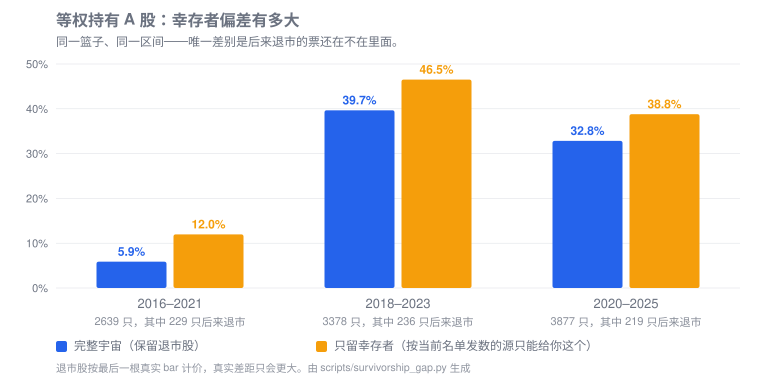
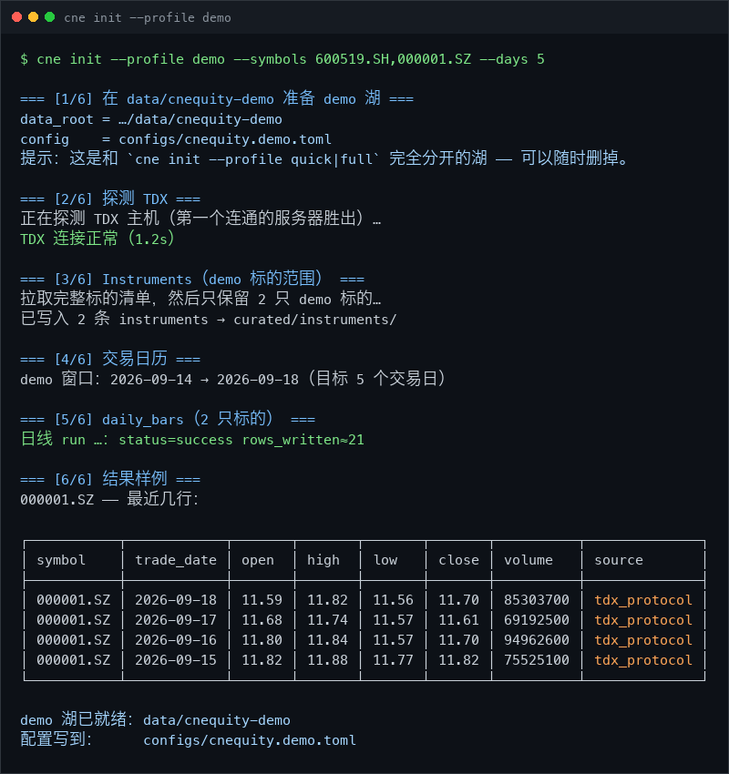

<h1 align="center">CNEquity · 中国市场金融数据湖</h1>
<p align="center">把多源的 A 股行情、基本面、事件与宏观数据，落到一份可日更、可回查的本地 Parquet 数据湖。</p>

<p align="center">
  <a href="https://github.com/rootSunc/cnequity/actions/workflows/ci.yml"></a>
  <a href="https://pypi.org/project/cnequity/"></a>
  <a href="https://www.python.org/downloads/"></a>
  <a href="LICENSE"></a>
  <a href="https://rootsunc.github.io/cnequity/"></a>
  <a href="README.en.md"></a>
</p>

CNEquity 从 A 股开始，解决的是一件很具体的事：把分散在不同来源、不同口径、不同更新节奏的数据，长期保存在自己的机器或服务器上，并且能说明每一行数据从哪里来、什么时候采到、截至哪一天可用。

项目开源、免注册、自托管。数据以开放格式落盘，可以用 Python、DuckDB、Polars 或其它工具读取；采集和查询彼此分开，数据湖本身不依赖某个客户端或模型。

## 为什么要一个数据湖

做 A 股历史研究时，发出一次请求通常不是最费事的部分。更难的是把下面几件事持续做好：

- 多个来源的字段和代码体系不一致，需要反复清洗、对齐和补缺；
- 每次研究都重新拉取数据，结果难以复现，也容易被上游接口的变化影响；
- 只用今天仍然上市的股票回看历史，会把退市股排除在样本之外；
- 财报、公告和估值数据有各自的发布日期，不能只按报告期判断“当时是否已经知道”；
- 复权、历史成分、交易状态等口径如果由每个研究脚本自己处理，很容易悄悄分叉。

幸存者偏差是一个直观例子。下面的实验使用同一个等权买入持有策略和同一段时间，唯一差别是历史股票池里是否保留后来退市的股票。只用今天仍在交易的股票时，2016–2021 年的收益从 **5.9%** 变成了 **12.0%**：

<p align="center">
  
</p>

那些股票不是收益为零，而是根本没有进入计算。CNEquity 因此把退市股、复权因子、历史成分和 PIT（按当时可获得的信息取数）放在数据层里处理，而不是交给每个下游脚本临时拼接。


## 数据范围

项目当前的主线是中国市场的 A 股研究，不追求把所有金融数据都收进来。已注册数据集覆盖：

- 证券主数据、交易日历和交易状态；
- 个股、指数、行业和板块的日线、分钟线、分笔与复权因子；
- 公司行为、公告索引和业绩披露预约；
- 财报、估值、股本、股东和分析师一致预期；
- 北向、融资融券、龙虎榜、大宗交易和资金流；
- 指数成分、行业分类、宏观指标和市场宽度；
- 新闻、快讯、情绪、轮动，以及解禁和监管事件。

当前注册表包含 **42 个数据集：39 个 curated + 3 个 derived**，按研究用途分为 L0–L8 九类。

| 层次 | 研究用途 | 代表数据集 |
|---|---|---|
| L0 | 基础参考 | 证券主数据、交易日历、交易状态 |
| L1 | 行情 | 日线、指数、复权因子、分钟线、分笔、退市事件 |
| L2 | 公司事件 | 公司行为、公告索引、预约披露 |
| L3 | 基本面 | 财报、估值、股本、股东、一致预期 |
| L4 | 资金面 | 北向、融资融券、龙虎榜、大宗交易、资金流 |
| L5 | 结构行业 | 指数成分、行业与板块成分 |
| L6 | 宏观 | 宏观指标、市场宽度 |
| L7 | 舆情与轮动 | 新闻、情绪、人气、板块行情与资金流 |
| L8 | 风险合规 | 解禁日程、监管事件 |

所有 curated 行都带有 `source`、`data_version` 和 `fetched_at`，可以追到来源和采集批次。分钟线、5 分钟线和分笔默认关闭，按需启用；部分只能获取当日快照的数据集不会被伪造成历史序列。

完整字段、主键、历史模式和源端限制见[数据集目录](docs/datasets/catalog.md)。

<details>
<summary><b>展开查看 42 个数据集及主备数据源</b></summary>

| 数据集 | 说明 | 主源 | 备源 | 历史 | 日更组 |
|---|---|---|---|---|---|
| **L0 · 基础参考** | | | | | |
| `instruments` | 证券主数据 | tdx_protocol | baostock | 可回补 | core |
| `trading_calendar` | 交易日历 | tdx_protocol | exchange | 可回补 | core |
| `trading_status` | 交易状态（停复牌/ST） | eastmoney | baostock | 可回补 | core |
| **L1 · 行情** | | | | | |
| `adj_factors` | 复权因子 | sina | — | 可回补 | — |
| `commodity_bars` ○ | 商品期货主连 | sina | eastmoney | 可回补 | macro_risk |
| `daily_bars` | 日线 | tdx_protocol | eastmoney | 可回补 | core |
| `delisting_events` | 退市事件 | derived | — | 可回补 | — |
| `index_bars` | 指数日线 | tdx_protocol | eastmoney | 可回补 | core |
| `minute_bars` ○ | 1 分钟线 | tdx_protocol | — | 可回补 | intraday |
| `minute_bars_5m` ○ | 5 分钟线 | tdx_protocol | — | 可回补 | intraday |
| `trade_ticks` ○ | 分笔快照 | tdx_protocol | — | 可回补 | ticks |
| **L2 · 公司事件** | | | | | |
| `announcement_index` | 公告索引 | cninfo | — | 可回补 | capital |
| `corporate_actions` | 公司行为 | tdx_protocol | eastmoney | 可回补 | core |
| `earnings_disclosure_schedule` | 业绩披露预约 | eastmoney | — | 可回补 | fundamentals |
| **L3 · 基本面** | | | | | |
| `analyst_consensus` | 分析师一致预期 | eastmoney | — | 仅当日 | research |
| `financial_statement_items` | 财务报表科目 | eastmoney | — | 可回补 | fundamentals |
| `share_structure` | 股本结构 | eastmoney | — | 可回补 | fundamentals |
| `shareholder_counts` | 股东户数 | eastmoney | — | 可回补 | fundamentals |
| `top_holders` | 前十大股东 / 流通股东 | eastmoney | — | 可回补 | 按需回填 |
| `valuation_metrics` | 估值指标 | eastmoney | — | 回填 `baostock` | capital |
| **L4 · 资金面** | | | | | |
| `block_trades` | 大宗交易 | eastmoney | — | 可回补 | signals |
| `dragon_tiger` | 龙虎榜 | eastmoney | — | 可回补 | signals |
| `fund_flow` | 个股资金流 | eastmoney | — | 仅当日 | capital |
| `institutional_holdings` | 机构持股 | eastmoney | — | 可回补 | research |
| `margin_trading` | 融资融券 | eastmoney | — | 可回补 | capital |
| `northbound_flows` | 北向资金流向 | eastmoney | — | 可回补 | capital |
| `northbound_holdings` | 北向持股 | eastmoney | — | 可回补 | capital |
| **L5 · 结构行业** | | | | | |
| `index_constituents` | 指数成分 | eastmoney | — | 回填 `cni` | fundamentals |
| `industry_index` | 行业指数 | derived | — | 可回补 | — |
| `industry_members` | 行业分类成分 | eastmoney | — | 回填 `sw` | fundamentals |
| `sector_members` | 板块成分 | eastmoney | — | 仅当日 | capital |
| **L6 · 宏观** | | | | | |
| `macro_indicators` | 宏观指标 | eastmoney | pboc | 可回补 | macro_risk |
| `market_breadth` | 市场宽度 | derived | — | 可回补 | macro_risk |
| **L7 · 舆情 / 轮动** | | | | | |
| `economic_calendar` ○ | 经济日历 | eastmoney | — | 仅当日 | — |
| `flash_news_wire` | 7×24 快讯 | eastmoney | — | 仅当日 | research |
| `hot_rank` | 人气榜 | eastmoney | — | 仅当日 | research |
| `news_headlines` | 新闻标题 | eastmoney | — | 仅当日 | research |
| `sector_bars` | 板块行情 | ths | — | 回填 `ths` | research |
| `sector_fund_flow` | 板块资金流 | eastmoney | — | 仅当日 | research |
| `sentiment_scores` | 情绪评分 | derived | eastmoney | 可回补 | research |
| **L8 · 风险合规** | | | | | |
| `regulatory_events` | 监管事件 | cninfo | — | 可回补 | macro_risk |
| `share_unlock_schedule` | 解禁日程 | eastmoney | — | 可回补 | macro_risk |

○ 表示可选数据集，空表不算异常。逐项说明见[数据集目录](docs/datasets/catalog.md)，源端限制见[数据源说明](docs/datasets/sources.md)。

</details>

## 适合什么场景

CNEquity 适合需要反复使用同一份历史数据的研究和数据工作：

- 多年行情回测，不想每次重新拉取、清洗和拼接复权；
- 需要把退市股、历史成分股和 PIT 纳入研究；
- 希望数据保存在本地或自己的服务器上，格式开放且来源可追溯；
- 想让 Python、DuckDB、Polars 和 AI agent 读取同一份数据。

如果只是查一只股票的最新价格，直接调用数据接口通常更轻。这个项目更适合需要持续积累、反复查询和复查结果的场景。

## 30 秒试玩

需要 Python 3.10+，无需 token、积分或账号：

```bash
pip install cnequity
cne demo
```

`cne demo` 默认拉取 5 只股票最近约 30 个交易日的真实数据，写入独立目录 `data/cnequity-demo/`，不会覆盖正式数据湖。需要能访问 TDX 行情主机；如果连接失败，可以先检查：

```bash
cne sources --only tdx_protocol
```

<p align="center">
  
</p>

然后在 Python 中读取：

```python
from cnequity.query import load

bars = load("daily_bars", data_root="data/cnequity-demo")
print(bars.tail())
```

想直接比较原始价格与后复权口径：

```bash
cne demo --research --symbols 600519.SH
```

## 5 分钟开始建湖

```bash
pip install cnequity
cne config init            # 生成 configs/cnequity.toml
cne init                   # 全市场标的，默认回溯最近 3 年
cne run daily              # 之后每个交易日执行这一条
```

默认策略是“浅而不窄”：历史先取最近 3 年，但全市场标的一个不缺。这样不会因为只保留今天仍上市的股票，提前把幸存者偏差写进数据湖。每个数据集的真实起点会记录在 `coverage_start`。

需要更长历史时可以一次拉满，也可以以后补深：

```bash
cne init --profile full

# 或对单个数据集补历史
cne backfill daily_bars --start 2016-01-01 --end <coverage_start>
```

默认初始化通常是小时级、GB 级，实际取决于网络、数据源状态和机器配置。详细安装说明见[快速开始](docs/getting-started/quickstart.md)和[安装指南](docs/getting-started/installation.md)。

## 能回答哪些问题

| 研究问题 | 推荐入口 |
|---|---|
| 茅台过去五年复权后涨了多少 | `load("daily_bars", symbols=[...], adjust="hfq")` |
| 茅台 PE 在自身五年历史中的分位数 | `valuation_metrics` + 窗口分位 |
| 2018 年财报因子的 IC，且不使用未来数据 | `load("financial_statement_items", as_of="2018-04-30")` |
| 退市股退市前 60 天的价格形态 | `delisting_events` + `daily_bars` |
| 三年前的沪深 300 成分或申万行业 | `index_constituents` · `industry_members` |
| 今天的龙虎榜、未来解禁和板块资金流 | `dragon_tiger` · `share_unlock_schedule` · `sector_fund_flow` |

常用查询：

```python
from cnequity.query import load

bars = load(
    "daily_bars",
    start="2020-01-01",
    end="2025-12-31",
    symbols=["600519.SH"],
    adjust="hfq",
)

roe = load(
    "financial_statement_items",
    items=["roe"],
    as_of="2024-04-30",
)
```

## 架构

<p align="center">
  
</p>
<p align="center"><sub>公开数据源 → 适配与编排 → 本地 Parquet 湖 → 质量、查询与只读服务</sub></p>

架构上的边界比较简单：适配器负责把多源数据取回来；编排层负责 DAG、批次和重试；数据先进入 staging，再压实为 curated 并计算 derived；质量层持续审计；查询和服务层只读消费。展开见[架构说明](docs/architecture/overview.md)。

## 日常使用与运维

```bash
cne run daily                 # 执行当天全部日更分组
cne status                    # 查看 FRESH / STALE / EMPTY
cne serve                     # 打开 http://127.0.0.1:8787
cne sources                   # 检查上游数据源健康度
cne retry --run-id <run_id>   # 只重试失败批次
```

单个 step 失败时，系统会记录 failed batch，其他步骤继续落盘；重试不会把整条任务重新跑一遍。浏览器控制台可以查看覆盖、新鲜度、容量、跑批和质量结果。

挂入 crontab 即可自动日更：

```bash
# 交易日收盘后执行；非交易日会自动跳过
30 16 * * 1-5  cd /path/to/lake && cne run daily >> logs/daily.log 2>&1
```

更多运维方式见[运行手册](docs/operations/runbook.md)、[数据源健康检查](docs/operations/source-health.md)和[故障排查](docs/operations/troubleshooting.md)。

#### 遗漏交易日怎么补（快照数据集）

`trading_status` 及其它 `fetch_semantics="snapshot"` 数据集失败后，能否自动补齐取决于**你何时重跑**：

- **当天复跑（trade_date 仍为 D）`cne run daily`** → **自动补齐 D**。失败日 watermark 不会推进，D 仍在增量窗口 `[watermark+1, D]` 内，重跑时会重新抓取。
- **隔天普通 `cne run daily`（trade_date = D+1）** → **不会**自动补齐 D。快照语义对 watermark 之前的日期只写入审计 finding、刻意不重放（避免把今天的标签回填到过去会话，即 "snapshot fetch semantics cannot backfill historical values"）。此时二选一：
  - `cne retry --run-id <失败的那次 run>` —— 只重放失败批次，效果等同于当天重跑；
  - `cne backfill trading_status --start D --end D` —— 显式按日回填。

**时间语义**：`trading_status` 主源是 EastMoney；启用 `[[failover.datasets]] name="trading_status" ... backup="baostock"` 后，baostock 兜底带**新鲜度闸**——当日数据尚未生成（baostock 当日晚间才结算当日会话）时拒绝兜底，宁缺勿假。因此 **16:00 核心波次**在"东财故障 + baostock 未出当日数据"时当天必然失败；请把补跑安排在 **18:00 之后**（此时 baostock 已有当日批次，备份可正常兜底）。

## 接给 AI agent

`cne mcp` 以只读方式把本地湖提供给模型；采集、重试和清理仍由 CLI 完成。

```bash
cne mcp --config "$(pwd)/configs/cnequity.toml"
```

把上面的命令作为 MCP server 注册到任意兼容客户端即可。大多数客户端使用等价的配置（客户端名称和界面可能不同）：

```json
{
  "mcpServers": {
    "cnequity": {
      "command": "cne",
      "args": ["mcp", "--config", "/abs/path/to/cnequity.toml"]
    }
  }
}
```

`--config` 必须使用绝对路径。接好后可以直接问：

- “茅台过去五年复权后涨了多少？”
- “茅台当前 PE 在自己五年历史里处于什么分位？”
- “计算 2018 年财报因子的 IC，不要使用未来数据。”
- “过去三年退市的股票，退市前 60 天有什么共同形态？”

还没有正式湖时，可以先运行 `cne demo`，再使用生成的 demo 配置。完整说明见[MCP 参考](docs/reference/mcp.md)。

## 与 AkShare、Tushare、Qlib 有什么不同

AkShare 和其它取数工具解决“怎样调用数据源”，Tushare 提供云端数据服务，Qlib / vn.py 更偏研究或交易平台。CNEquity 做的是中间的数据基础设施：把多源数据落成可日更、可复查、可溯源的本地 Parquet 湖。

| 你在意的能力 | CNEquity | 常规取数工具 | 云端数据服务 | 研究 / 交易平台 |
|---|---|---|---|---|
| 本地可续跑的数据底座 | **内置** | 通常自建 | 通常不提供 | 依平台而定 |
| 历史结果能否复查 | **行级溯源** | 缺少统一契约 | 依平台字段 | 依模块而定 |
| 复权 / universe / PIT | **统一在 `load()`** | 自己拼接 | 自己拼接 | 使用平台口径 |
| 单一数据源故障 | **按批失败，可单独重试** | 调用方处理 | 平台处理 | 依模块而定 |

更完整的逐项比较见[项目对比](docs/comparison.md)。

## 常见问题

<details>
<summary><b>初始化要多久、占多少磁盘？</b></summary>

默认配置拉取全市场最近 3 年，通常约 1 小时、GB 级；`--profile full` 从 2016 年开始，实测约 3 倍时间。网络环境与数据源状态会影响结果。

需要从 2001 年开始的日线：

```bash
cne init --since 2001-01-01
# 或事后补深
cne backfill daily_bars --start 2001-01-01
```

</details>

<details>
<summary><b>为什么落盘只存后复权因子？</b></summary>

前复权价格会随“今天”变化。落盘只存 hfq，qfq 在 `load(adjust="qfq")` 时计算，详见 [ADR-0004](docs/adr/0004-store-hfq-derive-qfq-at-query.md)。

</details>

<details>
<summary><b>东财返回 403 或连接重置怎么办？</b></summary>

先运行 `cne sources --only eastmoney_push2,eastmoney_push2his`。日更主路径行情走 TDX，不受东财行情接口风控影响。

</details>

<details>
<summary><b>为什么分钟线没有更早历史？</b></summary>

源端当前只保留约 95 个交易日的 1 分钟线、491 个交易日的 5 分钟线。这是上游保留期，不是数据湖尚未完成的回填任务。

</details>

<details>
<summary><b>数据可以商用或再分发吗？</b></summary>

项目代码使用 Apache-2.0；落盘的行情、公告等数据不随代码授权。使用与分发前请阅读[法律与数据源说明](docs/legal-and-data-sources.md)。

</details>

## 文档与项目状态

- [快速开始](docs/getting-started/quickstart.md) · [CLI 参考](docs/reference/cli.md) · [完整文档索引](docs/README.md)
- [数据集目录](docs/datasets/catalog.md) · [MCP 参考](docs/reference/mcp.md) · [运维手册](docs/operations/runbook.md)
- [ROADMAP](ROADMAP.md) · [CHANGELOG](CHANGELOG.md) · [贡献指南](CONTRIBUTING.md) · [安全策略](SECURITY.md)

这是个人维护的开源项目，issue 和 PR 都欢迎。用于论文或研究报告时，可引用仓库中的 [CITATION.cff](CITATION.cff)，并记录版本、覆盖范围及复权 / PIT 口径。

代码使用 [Apache-2.0](LICENSE)。仓库不附带数据湖，也不授予上游数据的再分发权。

---

如果 CNEquity 帮你省下了搭建数据底座的时间，欢迎点个 ⭐，让更多做 A 股研究的人看到它。
