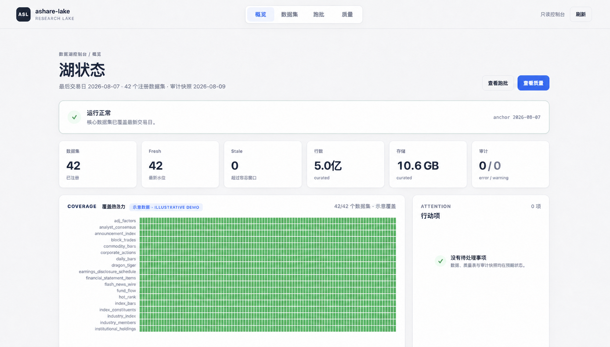
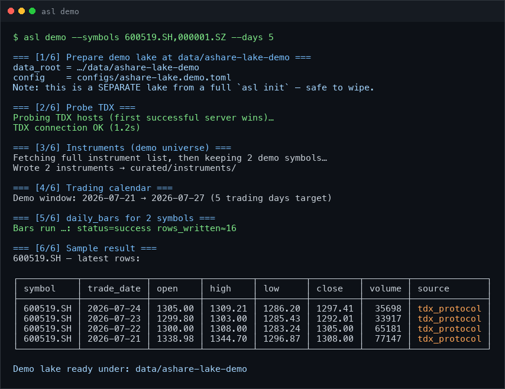

<h1 align="center">CML · CNMarketLake</h1>
<p align="center"><b>本地可日更的 A 股研究湖，为人和 AI agent 保存可复查的历史</b></p>

<p align="center">
  <a href="https://github.com/rootSunc/cn-market-lake/actions/workflows/ci.yml"></a>
  <a href="https://pypi.org/project/cn-market-lake/"></a>
  <a href="https://www.python.org/downloads/"></a>
  <a href="LICENSE"></a>
  <a href="https://rootsunc.github.io/cn-market-lake/"></a>
  <a href="README.en.md"></a>
</p>

<p align="center">
  无需 token、免注册、自托管。一次采集，支持持续日更；用 Python、DuckDB、Polars 或 AI agent 查询。<br>
  <b>42 个注册数据集 · L0–L8 九类研究数据 · 复权 / 历史股票池 / PIT · 行级溯源 · MCP</b>
</p>

<p align="center">
  
</p>

> 上图是用于 README 的合成演示图，覆盖热力图明确标注为 `ILLUSTRATIVE DEMO`，不代表当前生产数据状态。真实控制台只读，不会修改数据湖。

## 架构

<p align="center">
  
</p>
<p align="center"><sub>公开数据源 → 适配与编排 → 本地 Parquet 湖 → 质量、查询与只读服务</sub></p>

核心边界很简单：适配器负责把多源数据取回来；编排层负责 DAG、批次和重试；数据先进入 staging，再压实为 curated 并计算 derived；质量层持续审计；查询和服务层只读消费。展开见[架构说明](docs/architecture/overview.md)。

## 先看它是否适合你

CNMarketLake 不是又一个”临时请求一次行情”的接口。它更适合这些场景：

- 你要反复研究多年行情，不想每次重拉、清洗和拼复权；
- 你在意退市股、历史成分股和 PIT，不能接受不知不觉使用未来数据；
- 你希望数据保存在自己电脑或服务器上，格式开放、来源可追溯；
- 你想给 Python 研究代码、DuckDB、Polars 或 AI agent 共用同一份数据。

如果只想查一只股票的最新价格，直接取数通常更轻；如果要做可复查的历史研究，这个项目才真正有价值。

第一次使用，按这条路径即可：

```text
cml demo → cml init → cml run daily → load() / cml serve → cml mcp（可选）
```

## 30 秒跑通

需要 Python 3.10+，无需 token、积分或账号：

```bash
pip install cn-market-lake
cml demo
```

`cml demo` 默认拉取 5 只股票最近约 30 个交易日的真实数据，写入独立目录
`data/cn-market-lake-demo/`，不会覆盖正式数据湖。需要能访问 TDX 行情主机；若连接失败，先检查：

```bash
cml sources --only tdx_protocol
```

<p align="center">
  
</p>

然后在 Python 中读取：

```python
from cn_market_lake.query import load

bars = load("daily_bars", data_root="data/cn-market-lake-demo")
print(bars.tail())
```

想直接比较原始价格与后复权口径：

```bash
cml demo --research --symbols 600519.SH
```

## 5 分钟开始建湖

```bash
pip install cn-market-lake
cml config init            # 生成 configs/cn-market-lake.toml
cml init                   # 全市场标的，默认回溯最近 3 年
cml run daily              # 之后每个交易日执行这一条
```

默认策略是“浅而不窄”：历史先取最近 3 年，但全市场标的一个不缺。这样不会因为只保留今天仍上市的股票，提前把幸存者偏差写进数据湖。每个数据集的真实起点会记录在 `coverage_start`。

需要更长历史时可以一次拉满，也可以以后补深：

```bash
cml init --profile full

# 或对单个数据集补历史
cml backfill daily_bars --start 2016-01-01 --end <coverage_start>
```

默认初始化通常是小时级、GB 级，实际取决于网络、数据源状态和机器配置。详细安装说明见[快速开始](docs/getting-started/quickstart.md)和[安装指南](docs/getting-started/installation.md)。

## 为什么要一个数据湖

<p align="center">
  
</p>

同一个等权买入持有、同样的起止日期，唯一差别是后来退市的股票是否仍在历史股票池中。用“今天还在的股票”回看历史，2016–2021 五年收益会从 **5.9% 变成 12.0%**，看起来几乎翻倍。

这类错误很难从结果里发现：那些股票不是收益为零，而是根本没有进入计算。CNMarketLake 因此把退市股、复权因子、历史成分与 PIT 当作基础能力，而不是附加字段。

复现实验：

```bash
python scripts/survivorship_gap.py --lang zh --svg docs/assets/survivorship-gap.zh.svg
```

## 能回答哪些问题

| 研究问题 | 推荐入口 |
|---|---|
| 茅台过去五年复权后涨了多少 | `load("daily_bars", symbols=[...], adjust="hfq")` |
| 茅台 PE 在自身五年历史中的分位数 | `valuation_metrics` + 窗口分位 |
| 2018 年财报因子的 IC，且不使用未来数据 | `load("financial_statement_items", as_of="2018-04-30")` |
| 退市股退市前 60 天的价格形态 | `delisting_events` + `daily_bars` |
| 三年前的沪深 300 成分或申万行业 | `index_constituents` · `industry_members` |
| 今天的龙虎榜、未来解禁和板块资金流 | `dragon_tiger` · `share_unlock_schedule` · `sector_fund_flow` |

常用查询：

```python
from cn_market_lake.query import load

bars = load(
    "daily_bars",
    start="2020-01-01",
    end="2025-12-31",
    symbols=["600519.SH"],
    adjust="hfq",
)

roe = load(
    "financial_statement_items",
    items=["roe"],
    as_of="2024-04-30",
)
```

## 数据范围

当前注册表包含 **42 个数据集：39 个 curated + 3 个 derived**。按研究用途分为 L0–L8 九类；完整字段、主键、历史模式和源端限制见[数据集目录](docs/datasets/catalog.md)。

| 层次 | 研究用途 | 代表数据集 |
|---|---|---|
| L0 | 基础参考 | 证券主数据、交易日历、交易状态 |
| L1 | 行情 | 日线、指数、复权因子、分钟线、分笔、退市事件 |
| L2 | 公司事件 | 公司行为、公告索引、预约披露 |
| L3 | 基本面 | 财报、估值、股本、股东、一致预期 |
| L4 | 资金面 | 北向、融资融券、龙虎榜、大宗交易、资金流 |
| L5 | 结构行业 | 指数成分、行业与板块成分 |
| L6 | 宏观 | 宏观指标、市场宽度 |
| L7 | 舆情与轮动 | 新闻、情绪、人气、板块行情与资金流 |
| L8 | 风险合规 | 解禁日程、监管事件 |

所有 curated 行都包含 `source`、`data_version` 和 `fetched_at`，可以追到来源与采集批次。分钟线、5 分钟线和分笔默认关闭，按需启用；部分只能获取当日快照的数据集不会伪造成历史序列。

<details>
<summary><b>展开查看 42 个数据集及主备数据源</b></summary>

| 数据集 | 说明 | 主源 | 备源 | 历史 | 日更组 |
|---|---|---|---|---|---|
| **L0 · 基础参考** | | | | | |
| `instruments` | 证券主数据 | tdx_protocol | baostock | 可回补 | core |
| `trading_calendar` | 交易日历 | tdx_protocol | exchange | 可回补 | core |
| `trading_status` | 交易状态（停复牌/ST） | tdx_protocol | eastmoney | 可回补 | core |
| **L1 · 行情** | | | | | |
| `adj_factors` | 复权因子 | sina | — | 可回补 | — |
| `commodity_bars` ○ | 商品期货主连 | sina | eastmoney | 可回补 | macro_risk |
| `daily_bars` | 日线 | tdx_protocol | eastmoney | 可回补 | core |
| `delisting_events` | 退市事件 | derived | — | 可回补 | — |
| `index_bars` | 指数日线 | tdx_protocol | eastmoney | 可回补 | core |
| `minute_bars` ○ | 1 分钟线 | tdx_protocol | — | 可回补 | intraday |
| `minute_bars_5m` ○ | 5 分钟线 | tdx_protocol | — | 可回补 | intraday |
| `trade_ticks` ○ | 分笔快照 | tdx_protocol | — | 可回补 | ticks |
| **L2 · 公司事件** | | | | | |
| `announcement_index` | 公告索引 | cninfo | — | 可回补 | capital |
| `corporate_actions` | 公司行为 | tdx_protocol | eastmoney | 可回补 | core |
| `earnings_disclosure_schedule` | 业绩披露预约 | eastmoney | — | 可回补 | fundamentals |
| **L3 · 基本面** | | | | | |
| `analyst_consensus` | 分析师一致预期 | eastmoney | — | 仅当日 | research |
| `financial_statement_items` | 财务报表科目 | eastmoney | — | 可回补 | fundamentals |
| `share_structure` | 股本结构 | eastmoney | — | 可回补 | fundamentals |
| `shareholder_counts` | 股东户数 | eastmoney | — | 可回补 | fundamentals |
| `top_holders` | 前十大股东 / 流通股东 | eastmoney | — | 可回补 | 按需回填 |
| `valuation_metrics` | 估值指标 | eastmoney | — | 回填 `baostock` | capital |
| **L4 · 资金面** | | | | | |
| `block_trades` | 大宗交易 | eastmoney | — | 可回补 | signals |
| `dragon_tiger` | 龙虎榜 | eastmoney | — | 可回补 | signals |
| `fund_flow` | 个股资金流 | eastmoney | — | 仅当日 | capital |
| `institutional_holdings` | 机构持股 | eastmoney | — | 可回补 | research |
| `margin_trading` | 融资融券 | eastmoney | — | 可回补 | capital |
| `northbound_flows` | 北向资金流向 | eastmoney | — | 可回补 | capital |
| `northbound_holdings` | 北向持股 | eastmoney | — | 可回补 | capital |
| **L5 · 结构行业** | | | | | |
| `index_constituents` | 指数成分 | eastmoney | — | 回填 `cni` | fundamentals |
| `industry_index` | 行业指数 | derived | — | 可回补 | — |
| `industry_members` | 行业分类成分 | eastmoney | — | 回填 `sw` | fundamentals |
| `sector_members` | 板块成分 | eastmoney | — | 仅当日 | capital |
| **L6 · 宏观** | | | | | |
| `macro_indicators` | 宏观指标 | eastmoney | pboc | 可回补 | macro_risk |
| `market_breadth` | 市场宽度 | derived | — | 可回补 | macro_risk |
| **L7 · 舆情 / 轮动** | | | | | |
| `economic_calendar` ○ | 经济日历 | eastmoney | — | 仅当日 | — |
| `flash_news_wire` | 7×24 快讯 | eastmoney | — | 仅当日 | research |
| `hot_rank` | 人气榜 | eastmoney | — | 仅当日 | research |
| `news_headlines` | 新闻标题 | eastmoney | — | 仅当日 | research |
| `sector_bars` | 板块行情 | ths | — | 回填 `ths` | research |
| `sector_fund_flow` | 板块资金流 | eastmoney | — | 仅当日 | research |
| `sentiment_scores` | 情绪评分 | derived | eastmoney | 可回补 | research |
| **L8 · 风险合规** | | | | | |
| `regulatory_events` | 监管事件 | cninfo | — | 可回补 | macro_risk |
| `share_unlock_schedule` | 解禁日程 | eastmoney | — | 可回补 | macro_risk |

○ 表示可选数据集，空表不算异常。逐项说明见[数据集目录](docs/datasets/catalog.md)，源端限制见[数据源说明](docs/datasets/sources.md)。

</details>

## 日常使用与运维

```bash
cml run daily                 # 执行当天全部日更分组
cml status                    # 查看 FRESH / STALE / EMPTY
cml serve                     # 打开 http://127.0.0.1:8787
cml sources                   # 检查上游数据源健康度
cml retry --run-id <run_id>   # 只重试失败批次
```

单个 step 失败时，系统会记录 failed batch，其他步骤继续落盘；重试不会把整条任务重新跑一遍。浏览器控制台就是 README 首图中的界面，可查看覆盖、新鲜度、容量、跑批和质量结果。

挂入 crontab 即可自动日更：

```bash
# 交易日收盘后执行；非交易日会自动跳过
30 16 * * 1-5  cd /path/to/lake && cml run daily >> logs/daily.log 2>&1
```

更多运维方式见[运行手册](docs/operations/runbook.md)、[数据源健康检查](docs/operations/source-health.md)和[故障排查](docs/operations/troubleshooting.md)。

## 接给 AI agent

`cml mcp` 以只读方式把本地湖提供给模型；采集、重试和清理仍由 CLI 完成。

```bash
cml mcp --config "$(pwd)/configs/cn-market-lake.toml"
```

把上面的命令作为 MCP server 注册到任意兼容客户端即可。大多数客户端
使用等价的配置（客户端名称和界面可能不同）：

```json
{
  "mcpServers": {
    "cn-market-lake": {
      "command": "cml",
      "args": ["mcp", "--config", "/abs/path/to/cn-market-lake.toml"]
    }
  }
}
```

因此 Codex、Claude、Cline、Cursor、Windsurf、Gemini CLI 以及其它支持
MCP stdio 的 agent 都可以复用同一条 `command` / `args` 配置；CNMarketLake
不依赖任何特定模型或厂商 SDK。

`--config` 必须使用绝对路径。接好后可以直接问：

- “茅台过去五年复权后涨了多少？”
- “茅台当前 PE 在自己五年历史里处于什么分位？”
- “计算 2018 年财报因子的 IC，不要使用未来数据。”
- “过去三年退市的股票，退市前 60 天有什么共同形态？”

还没有正式湖时，可以先运行 `cml demo`，再使用生成的 demo 配置。完整说明见[MCP 参考](docs/reference/mcp.md)。

## 与 AkShare、Tushare、Qlib 有什么不同

AkShare 和取数工具解决”怎样调用数据源”，Tushare 提供云端数据服务，Qlib / vn.py 更偏研究或交易平台。CNMarketLake 做的是中间的数据基础设施：把多源数据落成可日更、可复查、可溯源的本地 Parquet 湖。

| 你在意的能力 | CNMarketLake | 常规取数工具 | 云端数据服务 | 研究 / 交易平台 |
|---|---|---|---|---|
| 本地可续跑的数据底座 | **内置** | 通常自建 | 通常不提供 | 依平台而定 |
| 历史结果能否复查 | **行级溯源** | 缺少统一契约 | 依平台字段 | 依模块而定 |
| 复权 / universe / PIT | **统一在 `load()`** | 自己拼接 | 自己拼接 | 使用平台口径 |
| 单一数据源故障 | **按批失败，可单独重试** | 调用方处理 | 平台处理 | 依模块而定 |

更完整的逐项比较见[项目对比](docs/comparison.md)。

## 常见问题

<details>
<summary><b>初始化要多久、占多少磁盘？</b></summary>

默认配置拉取全市场最近 3 年，通常约 1 小时、GB 级；`--profile full` 从 2016 年开始，实测约 3 倍时间。网络环境与数据源状态会影响结果。

需要从 2001 年开始的日线：

```bash
cml init --since 2001-01-01
# 或事后补深
cml backfill daily_bars --start 2001-01-01
```

</details>

<details>
<summary><b>为什么落盘只存后复权因子？</b></summary>

前复权价格会随“今天”变化。落盘只存 hfq，qfq 在 `load(adjust="qfq")` 时计算，详见 [ADR-0004](docs/adr/0004-store-hfq-derive-qfq-at-query.md)。

</details>

<details>
<summary><b>东财返回 403 或连接重置怎么办？</b></summary>

先运行 `cml sources --only eastmoney_push2,eastmoney_push2his`。日更主路径行情走 TDX，不受东财行情接口风控影响。

</details>

<details>
<summary><b>为什么分钟线没有更早历史？</b></summary>

源端当前只保留约 95 个交易日的 1 分钟线、491 个交易日的 5 分钟线。这是上游保留期，不是数据湖尚未完成的回填任务。

</details>

<details>
<summary><b>数据可以商用或再分发吗？</b></summary>

项目代码使用 Apache-2.0；落盘的行情、公告等数据不随代码授权。使用与分发前请阅读[法律与数据源说明](docs/legal-and-data-sources.md)。

</details>

## 文档与项目状态

- [快速开始](docs/getting-started/quickstart.md) · [CLI 参考](docs/reference/cli.md) · [完整文档索引](docs/README.md)
- [数据集目录](docs/datasets/catalog.md) · [MCP 参考](docs/reference/mcp.md) · [运维手册](docs/operations/runbook.md)
- [ROADMAP](ROADMAP.md) · [CHANGELOG](CHANGELOG.md) · [贡献指南](CONTRIBUTING.md) · [安全策略](SECURITY.md)

这是个人维护的开源项目，issue 和 PR 都欢迎。用于论文或研究报告时，可引用仓库中的 [CITATION.cff](CITATION.cff)，并记录版本、覆盖范围及复权 / PIT 口径。

代码使用 [Apache-2.0](LICENSE)。仓库不附带数据湖，也不授予上游数据的再分发权。

---

如果 CNMarketLake 帮你省下了搭建数据底座的时间，欢迎点个 ⭐，让更多做 A 股研究的人看到它。
